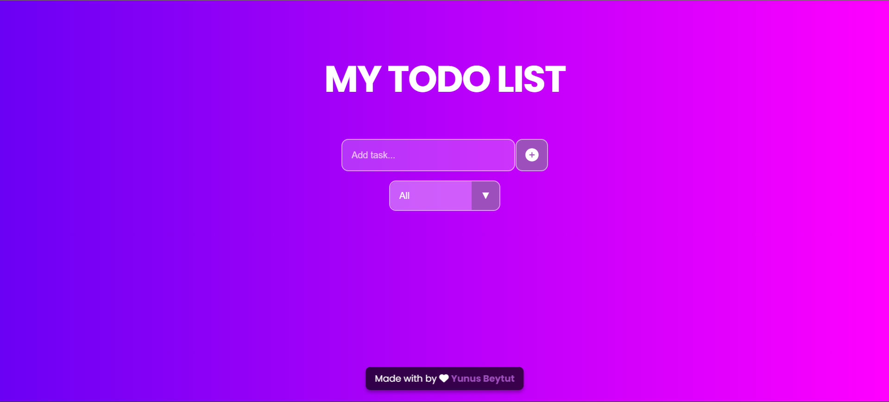
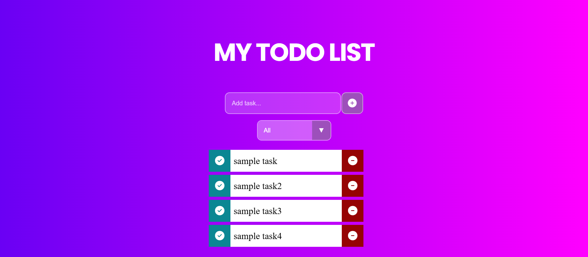
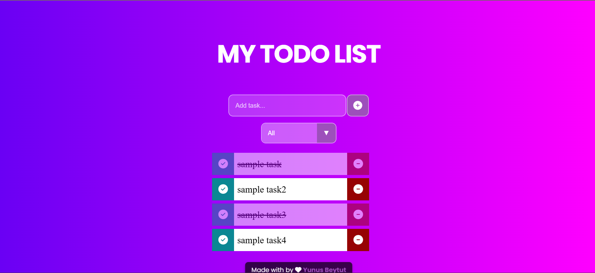

# 🚀 Advanced To-Do List with LocalStorage
  

## 🔍 Genel Bakış
Bu proje, kullanıcıların günlük görevlerini ekleyip yönetebileceği basit ve etkili bir **To-Do List** uygulamasıdır. Tamamen frontend teknolojileriyle (HTML, CSS, JavaScript) geliştirilmiş olup, veriler tarayıcının `localStorage`'ında saklanır.

## ✨ Özellikler
- ✅ Yeni görev ekleme
- ✔️ Görevleri tamamlanmış olarak işaretleme
- ✏️ Görevleri düzenleme
- 🗑️ Görevleri silme
- 🔍 Görevleri filtreleme (Tümü, Tamamlananlar, Tamamlanmayanlar)
- 🌙 Koyu/Açık tema desteği
- 📦 Verilerin tarayıcıda kalıcı olarak saklanması (LocalStorage)

## 🛠️ Kullanılan Teknolojiler
- **HTML5** - Yapısal temel
- **CSS3** - Tasarım ve animasyonlar
- **JavaScript (ES6)** - İşlevsellik
- **LocalStorage** - Veri kalıcılığı

## 📸 Ekran Görüntüleri

 | Görev Düzenleme | Example |
|-----------------|-----------|
|  |  |

## 🚀 Canlı Demo
Uygulamayı hemen deneyin: [https://yunusbeytut-to-do.netlify.app](https://yunusbeytut-to-do.netlify.app)

## 📜 Nasıl Çalıştırılır?
1. **Online**: Yukarıdaki "Canlı Demo" bağlantısını kullanın
2. **Local**:
   - Bu repo'yu klonlayın
   - `index.html` dosyasını tarayıcıda açın
   - Uygulama otomatik olarak çalışacaktır (LocalStorage kullanır)

## 📌 Notlar
- Tüm veriler tarayıcınızın yerel depolama alanında saklanır, farklı cihazlarda senkronize olmaz
- Responsive tasarım sayesinde mobil ve tablet cihazlarda da kullanılabilir

---

🛠️ **Geliştirici**: Yunus Beytüt  
📧 **İletişim**: [yunusbeytut0@gmail.com](yunusbeytut0@gmail.com)  
📅 **Son Güncelleme**: March 2024
